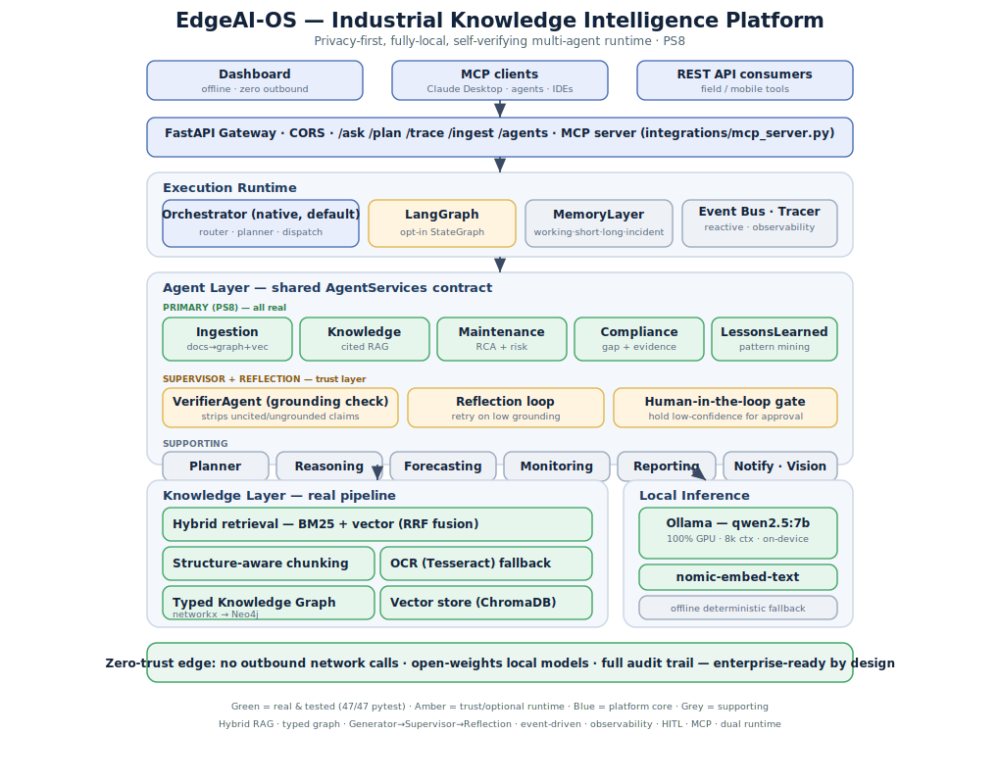

# EdgeAI-OS — Industrial Knowledge Intelligence Platform

**A privacy-first, fully-local, self-verifying multi-agent runtime that turns a plant's scattered documents into queryable, cited, operational intelligence.**

Built for **ET AI Hackathon 2026 · Problem Statement 8** ("AI for Industrial Knowledge Intelligence: Unified Asset & Operations Brain").

`62 automated tests` · `zero cloud dependencies` · `runs on a laptop with an 8GB GPU`

---

## What it does

Ask *"What did the inspection find about the P-101A bearing?"* and get a **synthesized, source-cited, verified** answer in milliseconds. Then go beyond retrieval:

> *"On P-101A (pump), elevated vibration indicates active degradation. The causal path elevated vibration → bearing wear → temperature rise → lubrication breakdown → seal failure → unplanned shutdown reaches elevated risk in ~318h. This pattern occurred before (Aug 2025, Mar 2026); the prior fix was re-torquing to OEM spec — recurrence suggests the root cause was not addressed. Root-cause correction scheduled during the next planned outage."*

That is the **Industrial Reasoning Engine**: causal + temporal + episodic + planning reasoning over a typed knowledge graph — not another RAG wrapper.

## Key capabilities

- **5 primary agents (PS8):** Ingestion, Knowledge Copilot, Maintenance & RCA, Compliance, Lessons Learned — all real, all tested.
- **Trust layer:** every answer passes a **VerifierAgent** grounding check (ungrounded claims stripped), a **reflection retry** on weak grounding, and a **human-approval gate** for low-confidence results. No unverified answer reaches a user.
- **Industrial Reasoning Engine:** causal failure-propagation ontology, temporal knowledge graph ("what changed between June and July"), episodic organizational memory ("seen twice before"), and a what-if failure simulator (`/simulate`).
- **Autonomous workflow with human approval:** high-risk findings auto-draft work orders; on engineer approval, every step executes with a full audit trail (notify → reserve parts → CMMS adapter handoff → memory).
- **Hybrid GraphRAG retrieval:** BM25 + vector fusion (RRF), structure-aware chunking, graph-augmented query expansion.
- **Fully local inference:** Ollama (`qwen2.5:7b` + `nomic-embed-text`) on-device; deterministic offline fallback when no model is present. The dashboard is air-gapped (all assets vendored — zero outbound requests).
- **Multi-modal ingestion:** text PDFs, scanned PDFs (Tesseract OCR), and P&ID drawings (OpenCV symbol/line detection + OCR tag extraction into the same graph).
- **Enterprise runtime:** event-driven ingestion cascade, per-dispatch observability traces (`/trace`), MCP server (query the plant brain from Claude Desktop or any MCP client), opt-in LangGraph execution, optional Neo4j persistence.

## Quickstart

```bash
git clone <your-repo-url>
cd edgeai-os
python -m venv .venv
# Windows: .venv\Scripts\activate   |   Linux/macOS: source .venv/bin/activate
pip install -r requirements.txt

pytest                                   # expect 61+ passed (1 skip without Neo4j)

uvicorn backend.main:app --reload --port 8000
```

Open `frontend/index.html` in a browser (or `python -m http.server 5500` from `frontend/`). Click **Ingest sample**, then ask the Copilot a question. The dashboard works even with the backend down (bundled sample data + offline banner).

### Full privacy-first mode (local LLM)

```bash
ollama pull qwen2.5:7b
ollama pull nomic-embed-text
# Windows PowerShell:
$env:EDGEAI_LLM="ollama"; $env:EDGEAI_OLLAMA_MODEL="qwen2.5:7b"; $env:EDGEAI_EMBED="ollama"
uvicorn backend.main:app --reload --port 8000
```

Nothing leaves the machine. See **[docs/INTEGRATION.md](docs/INTEGRATION.md)** for every optional integration (Neo4j, OCR, MCP server, LangGraph) and the full env-var reference.

## API surface

| Endpoint | What it does |
|---|---|
| `POST /ask` | Cited Q&A: retrieve → synthesize → verify → reflect → approval gate |
| `POST /reason` | Industrial Reasoning Engine: causal chain, time-to-risk, precedent, plan |
| `POST /simulate` | What-if failure: ripple effects, downtime, cost band, spares |
| `POST /workorders/draft` · `/{id}/approve` | Auto-drafted work orders, human-gated execution + audit |
| `POST /plan` | Multi-agent goal decomposition (Planner → agents) |
| `POST /ingest/upload` · `/ingest/sample` | Document ingestion + event-driven cascade |
| `POST /stream/tick` | Simulated sensor feed through the real SPC anomaly detector |
| `GET /trace` · `/memory` · `/knowledge/stats` | Observability, memory, graph stats |

Interactive docs at `http://localhost:8000/docs` once running.

## Architecture



```
Clients (air-gapped dashboard · MCP clients · REST)
  → FastAPI gateway
  → Execution runtime  (native Orchestrator | opt-in LangGraph · memory · event bus · tracer)
  → Agent layer        (5 primary + Verifier/Reflection/HITL trust layer + 7 supporting)
  → Knowledge layer    (hybrid BM25+vector RAG · typed/temporal knowledge graph · OCR · P&ID vision)
  → Local inference    (Ollama · offline deterministic fallback)
```

Full design: [docs/Architecture.md](docs/Architecture.md) · pitch deck: `docs/EdgeAI-OS_PS8_Deck.pptx`

## Evaluation

```bash
python scripts/evaluate.py
```

Prints entity-extraction P/R, retrieval hit@k, time-to-answer vs. manual baseline, compliance-gap precision, graph linkage, and answer-grounding coverage (writes `benchmarks/results.json`). On the bundled sample corpus all core metrics score 1.0; re-run against real documents for defensible field numbers.

## Repository layout

```
agents/            12 agents + reasoning engine, reflection, simulation
backend/
  api/routes.py    REST surface
  core/            orchestrator · memory · events · trace · policy · workflow ·
                   episodic · sensor_stream · langgraph_runtime
knowledge/         pipeline · hybrid vector store · typed graph (networkx/Neo4j) ·
                   ontology · temporal graph · OCR/PDF extract · P&ID vision
frontend/          single-file air-gapped dashboard (+ vendored assets)
integrations/      MCP server
datasets/samples/  synthetic sample report + P&ID (needed by tests/demo)
scripts/           evaluate.py · sample generators
tests/             62 tests across 9 suites
docs/              architecture · integration guide · plan · pitch deck
```

## Honest scope

Curated causal ontology (transparent rules, not learned physics) · simulator cost/downtime bands are labeled heuristics · P&ID vision is tuned for clean digital drawings · the CMMS/SAP hop is a mock adapter marking the real integration boundary · sensor feed is simulated (`simulated: true`) where a historian would plug in. GNN/RL/digital-twin physics are roadmap, not claims.

## License

See [LICENSE](LICENSE).
